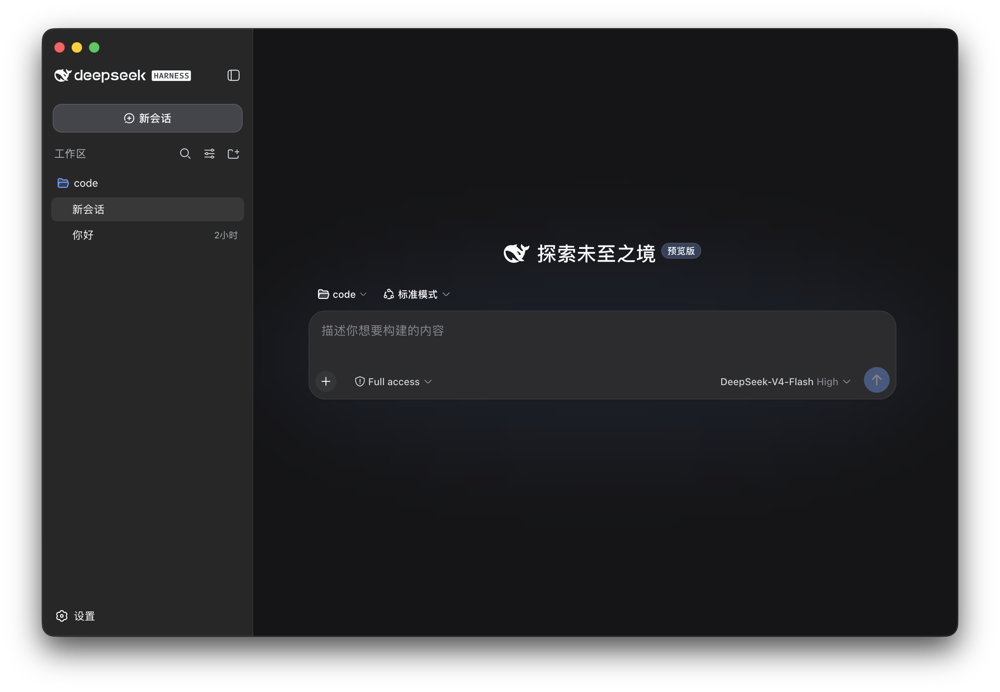

<h1 align="center">
  
  DeepSeek Harness Desktop
</h1>

<p align="center">
  A cross-platform desktop client for <a href="https://github.com/deepseek-ai/deepseek-harness">DeepSeek Harness</a>
</p>

<p align="center">
  <a href="LICENSE"></a>
  
  
  <a href="https://github.com/lunar-landing/deepseek-harness-desktop/actions/workflows/build.yml"></a>
</p>

<p align="center">
  <a href="https://lunar-landing.github.io/deepseek-harness-desktop/">Website</a> · <a href="https://github.com/lunar-landing/deepseek-harness-desktop/releases">Download</a> · <a href="https://github.com/lunar-landing/deepseek-harness-desktop/issues">Issues</a>
</p>

<p align="center">
  <a href="README.zh.md">简体中文</a>
</p>



<p align="center"><strong>Ready-to-use DeepSeek Harness desktop client for Windows and macOS, no configuration required.</strong></p>

DeepSeek Harness Desktop packages the DeepSeek Harness web experience as a desktop application. It launches a local Harness instance automatically, manages ports, persists profiles, plugins, and sessions, and opens the full interface as soon as Harness is ready.

> [!NOTE]
> This is a community-maintained open source project, not an official DeepSeek product.

## Features

- 🚀 **Ready to Use** - Auto-detects and connects to existing DeepSeek Harness servers, no complex configuration needed
- 💻 **Cross-Platform** - Supports Windows and macOS (Apple Silicon and Intel)
- 📦 **Multiple Install Options** - Windows offers installer (NSIS) and portable versions, macOS offers portable version
- 🎨 **Clean Interface** - Frameless window design with white theme, refreshing visual experience
- ⚡ **Lightweight & Fast** - Quick startup, smooth operation, low resource usage
- 🔒 **Secure** - Sandboxed renderer, disabled Node.js permissions, context isolation enabled

## Download

Download the latest version from [GitHub Releases](https://github.com/lunar-landing/deepseek-harness-desktop/releases).

### Windows

| Version | Format | Description |
|---------|--------|-------------|
| Installer | `.exe` | NSIS installer with custom install directory and shortcuts (Recommended) |
| Portable | `.zip` | Extract and run, suitable for portable use cases |

### macOS

| Version | Format | Description |
|---------|--------|-------------|
| Universal | `.zip` | Supports Apple Silicon and Intel chips |

## Installation

### Windows Installer

1. Download `DeepSeek-Harness-Desktop-Setup-*.exe`
2. Run the installer and follow the prompts
3. Launch from desktop shortcut or Start menu

### Windows Portable

1. Download `DeepSeek-Harness-Desktop-Windows-x64-Portable.zip`
2. Extract to any directory
3. Run `DeepSeek-Harness-Desktop.exe`

### macOS

1. Download `DeepSeek-Harness-Desktop-macOS-x64.zip`
2. Extract to any directory
3. Run `DeepSeek-Harness-Desktop.app`
4. If prompted "cannot verify developer", allow in **System Preferences → Security & Privacy**

## Why This Project

DeepSeek Harness already provides a complete agent runtime and Web UI. DeepSeek Harness Desktop does not reimplement Harness; it supplies the host capabilities needed for a desktop product:

- Run without manually starting a CLI or managing local ports
- Create an application-owned Harness launch directory automatically at startup
- Add and manage project workspaces through Harness's built-in directory picker
- Manage the Harness child process, readiness checks, logs, and shutdown in one place
- Store profiles, plugins, and sessions outside the application installation directory so upgrades do not remove user data
- Provide packaging entry points for macOS and Windows

## Architecture

```text
DeepSeek Harness Desktop (Electron Main)
├── Application-owned launch directory
├── Harness child-process lifecycle
├── Random loopback port and readiness checks
├── Native logging and recovery actions
└── Hardened BrowserWindow
     └── http://127.0.0.1:<random>  DeepSeek Harness Web UI

Electron userData
├── launch-root/
├── logs/harness.log
└── harness/
    ├── profiles/
    ├── sessions/
    └── Plugins and user data
```

## Development

### Requirements

- Node.js 22 or later
- npm
- macOS (Apple Silicon or Intel) or Windows x64

### Local Development

```bash
git clone https://github.com/lunar-landing/deepseek-harness-desktop.git
cd deepseek-harness-desktop
npm install
npm start
```

### Build

```bash
# Generate icons
npm run create-icons

# Build for current platform
npm run build

# Build Windows portable version
npm run build:win

# Build Windows installer
npm run build:win:installer

# Build macOS version
npm run build:mac
```

## Project Structure

```text
deepseek-harness-desktop/
├── .github/
│   └── workflows/
│       ├── build.yml          # Build and release workflow
│       └── pages.yml          # GitHub Pages deployment
├── build/
│   └── icons/                 # Application icons
├── docs/
│   ├── index.html             # Download page
│   └── images/                # Documentation images
├── main.js                    # Electron main process
├── preload.js                 # Preload script
├── create-icons.js            # Icon generation script
├── build.js                   # Local build script
├── logo.svg                   # Application logo
└── package.json               # Project configuration
```

## Release New Version

```bash
# Update version
npm version patch    # or minor, major

# Push to GitHub
git push origin master --tags
```

GitHub Actions will automatically build and publish to [Releases](https://github.com/lunar-landing/deepseek-harness-desktop/releases).

For detailed release instructions, see [RELEASE.md](RELEASE.md).

## Community

- [GitHub Issues](https://github.com/lunar-landing/deepseek-harness-desktop/issues) - Report bugs and request features
- [GitHub Discussions](https://github.com/lunar-landing/deepseek-harness-desktop/discussions) - Questions and discussions

## Related Projects

- [DeepSeek Harness](https://github.com/deepseek-ai/deepseek-harness) - Official DeepSeek Harness project
- [DSH Market](https://github.com/dsh-market/dsh-market) - DeepSeek Harness plugin marketplace

## Contributing

Issues and pull requests are welcome. Before submitting a change, please ensure:

```bash
npm test
npm run typecheck
npm run build
```

Never include real API keys in issues, logs, screenshots, or test data.

## License

This project is open source under the [MIT License](LICENSE).

DeepSeek Harness and its dependencies remain subject to their respective upstream licenses and trademark policies. DeepSeek Harness Desktop is an independent community desktop wrapper.

---

<p align="center">
  <sub>Community-maintained open source project, not an official DeepSeek product</sub>
</p>